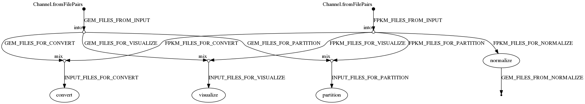

# GEMprep

This repository contains a variety of tools for gene expression matrices (GEMs). These tools can be used individually or through a [Nextflow](https://nextflow.io/) pipeline, also provided in this repository:



## Dependencies

The recommended way to use the scripts in this repository is with an Anaconda environment. To create an Anaconda environment:
```
module add anaconda3/5.1.0

conda create -n myenv python=3.6 matplotlib mpi4py numpy pandas r scikit-learn seaborn
```

To use the Nextflow pipeline, you must first install Nextflow:
```
module add java/1.8.0

curl -s https://get.nextflow.io | bash

./nextflow run hello
```

## Usage

### Nextflow

The Nextflow pipeline can run several tools on a set of GEM files in a single run using the scripts in the `bin` folder. By default, the pipeline uses all GEM files in the `input` directory, runs all steps that are enabled in `nextflow.config`, and saves all results to the `output` folder. There are several settings, such as the directory to your conda environment and the steps to run, which can be found in the `params` section of `nextflow.config`. These settings can be modified to fit the user's needs.

To run the Nextflow pipeline:
```
# place input files in the input directory
mkdir input
# ...

nextflow run main.nf
```

### Plaintext and Binary formats

The primary way to store an expression matrix in a file is as a tab-delimited text file which includes the row names and column names. The same matrix can also be stored as a binary Numpy (`.npy`) file, which includes only the data, and separate text files for the row names and column names. The script `convert.py` can convert expression matrix files between these two formats:
```
# convert an expression matrix from plaintext to binary
python bin/convert.py GEM.txt

# convert the binary matrix back to plaintext
python bin/convert.py GEM.npy
```

Every Python script in this repository can load and save expression matrices using either format, depending on whether you provide `txt` or `npy` file arguments.

### Normalize

To normalize an FPKM expression matrix, use the `normalize.R` script:
```
Rscript bin/normalize.R
```

This script expects an input file called `FPKM.txt` and performs log2 transform, KS test outlier removal, and quantile normalization. It produces a normalized matrix file called `GEM.txt` as well as a log file of the KS test results and several visualizations.

### Visualize

To create visualizations of an expression matrix, use the `visualize.py` script:
```
python bin/visualize.py -i [infile] [options]
```

This script takes an expression matrix file (which may or may not be normalized) and creates several visualizations based on the command line arguments that you provide. Currently this script supports two visualizations:

- Density plot: plot the distribution of each sample
- t-SNE plot: plot the t-SNE of all samples

For an unnormalized matrix, the sample distributions will vary greatly, but for a normalized matrix, the samples should have similar distributions. For the t-SNE plot, a label file can be provided to color the data points by their respective label. The file should contain a label for each sample, separated by newlines. The labels can be text or numeric.

### Partitioning

To partition an expression matrix into several sub-matrices, use the `partition.py` script:
```
# use a pre-defined partition file
python bin/partition.py -i [infile] -p [partition-file]

# use an automatic partitioning scheme with N partitions
python bin/partition.py -i [infile] -n N
```

This script takes an expression matrix and creates several submatrices based on a partitioning scheme. You can either provide a custom partition file or use the script to automatically generate partitions. The partition file should have two columns, the first column being sample names and the second column being partition labels. When generating partitions automatically, the script will output the resulting partition file, which you can modify to create your own partition files. Run with `-h` to see the list of available options.
