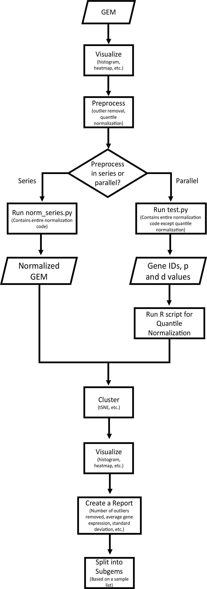

# GEMprep

This repository contains a variety of tools for gene expression matrices (GEMs). These tools include:

- Normalization: log2 transform, KS-test outlier removal, quantile normalization
- Visualization: t-SNE, sample distributions

TODO: Included is a Nextflow workflow which provides a single interface through which to use the GEMprep tools:




This repository is designed for use on Clemson University's Palmetto Cluster. Documentation for the Palmetto Cluster can be found [here](https://www.palmetto.clemson.edu/palmetto/).

## Prerequisites

The recommended way to use the scripts in this repository is with an Anaconda environment. To create an Anaconda environment:
```
module add anaconda3/5.1.0

conda create -n myenv python=3.6
```

From here you can activate your environment and install any necessary packages for Python and R:
```
source activate myenv

conda install matplotlib mpi4py numpy pandas scikit-learn seaborn
conda install r

source deactivate
```

To use the Nextflow workflow, you must first install Nextflow:
```
module add java/1.8.0

curl -s https://get.nextflow.io | bash

./nextflow run hello
```

## Tools

### Plaintext and Binary formats

The primary way to store an expression matrix in a file is as a tab-delimited text file which includes the row names and column names. The same matrix can also be stored as a binary Numpy (`.npy`) file, which includes only the data, and separate text files for the row names and column names. The scripts `text-to-bin.py` and `bin-to-text.py` can convert expression matrix files between these two formats:
```
# convert an expression matrix from plaintext to binary
python scripts/text-to-bin.py GEM.txt

# convert the binary matrix back to plaintext
python scripts/bin-to-text.py GEM.npy
```

Some of the Python scripts in this repository require the input expression matrix in the binary format because it takes much less time to load into memory. Therefore, you may need to convert your expression matrix into binary before processing it with a Python script. Note that only some of the Python scripts have this requirement.

### Normalize

To normalize an FPKM expression matrix, use the `normalize.R` script:
```
Rscript scripts/normalize.R
```

This script expects an input file called `FPKM.txt` and performs log2 transform, KS test outlier removal, and quantile normalization. It produces a normalized matrix file called `GEM.txt` as well as a log file of the KS test results and several visualizations.

### Visualize

To visualize the sample distributions of an expression matrix, use the `visualize.py` script:
```
python scripts/visualize.py -i [infile] -o [plotfile]
```

This script takes an expression matrix file (which may or may not be normalized) and plots the density of each sample in the matrix. For an unnormalized matrix, the sample distributions will vary greatly, but for a normalized matrix, the samples should have similar distributions.
