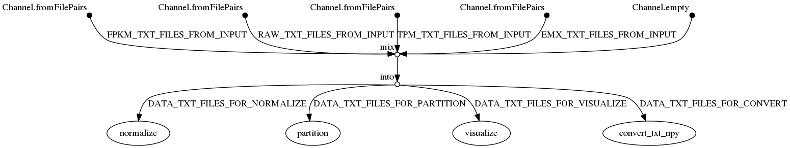

# GEMprep

This repository contains a variety of tools for gene expression matrices (GEMs). These tools can be used individually or through a [Nextflow](https://nextflow.io/) pipeline, also provided in this repository:



## Dependencies

The recommended way to use the scripts in this repository is with an Anaconda environment. To create an Anaconda environment:
```bash
module load anaconda3/5.1.0-gcc

conda env create -f environment.yml
```

Once this environment has been created, the R package `preprocessCore` must be seperately installed:

```bash
source activate gemprep

# open a shell in R
R

> install.packages("BiocManager")
> BiocManager::install()
> BiocManager::install(c("preprocessCore"))
```

To use the Nextflow pipeline, you must first install Nextflow:
```bash
curl -s https://get.nextflow.io | bash

./nextflow run hello
```

Or refer to the [pbs-toolkit](https://github.com/bentsherman/pbs-toolkit) repository for a script to install Nextflow as a module.

## Usage

For any of the Python scripts described below, you can run the script with the `-h` option to see all of the available options. Be sure to check that your GEM file matches the structure expected by a script before running the script. Some scripts expect (genes x samples) and some expect (samples x genes).

### Plaintext and Binary formats (convert.py)

The primary way to store an expression matrix in a file is as a tab-delimited text file which includes the row names and column names. The same matrix can also be stored as a binary Numpy (`.npy`) file, which includes only the data, and separate text files for the row names and column names. The script `convert.py` can convert expression matrix files between these two formats:
```bash
# convert an expression matrix from plaintext to binary
bin/convert.py GEM.txt GEM.npy

# convert the binary matrix back to plaintext
bin/convert.py GEM.npy GEM.txt
```

Every Python script in this repository can load and save expression matrices using either format, depending on whether you provide `txt` or `npy` file arguments.

### Normalizations (normalize.py)

To normalize an expression matrix, there are two scripts, `normalize.py` and `normalize.R`. Both scripts have the same functionality. The Python script is easier to use and can perform outlier removal in parallel, but it's implementation of quantile normalization does not exactly match the R implementation.

To use the `normalize.py` script:
```bash
bin/normalize.py <infile> <outfile> [options]
```

To use the `normalize.R` script:
```bash
bin/normalize.R [--log2] [--kstest] [--quantile]
```

This script expects an input file called `FPKM.txt` and performs log2 transform, KS test outlier removal, and quantile normalization. It produces a normalized matrix file called `GEM.txt` as well as a log file of the KS test results and several visualizations.

There is also a script, `normalize-frankenstein.pbs` that combines these two scripts in a PBS job submission, performing the K-S test and outlier removal using `normalize.py` and then performs quantile normalization using `normalize.R`. This script should be edited to provide the path to the input file as well as both the R and python normalization scripts. It expects an input in the form of `<dataset>.fpkm.txt` and outputs the GEM as `<dataset>.emx.txt`.

### Visualizations (visualize.py)

To create visualizations of an expression matrix, use the `visualize.py` script:
```bash
bin/visualize.py <infile> [options]
```

This script takes an expression matrix file (which may or may not be normalized) and creates several visualizations based on the command line arguments that you provide. Currently this script supports two visualizations:

- Density plot: plot the distribution of each sample
- t-SNE plot: plot the t-SNE of all samples

For an unnormalized matrix, the sample distributions will vary greatly, but for a normalized matrix, the samples should have similar distributions. For the t-SNE plot, a label file can be provided to color the data points by their respective label. The file should contain a label for each sample, separated by newlines. The labels can be text or numeric.

For the t-SNE plot, you can also control the display style of each class. Here's an example:
```bash
bin/visualize.py \
    tcga.emx.txt \
    --labels tcga.labels.txt \
    --tsne tcga.tsne.png \
    --tsne-classes BLCA GBM LGG OV THCA \
    --tsne-sizes 20 40 20 20 20 \
    --tsne-colors blueviolet crimson deepskyblue springgreen lightpink \
    --tsne-alphas 0.5 1.0 0.5 0.5 0.5
```

The example above will produce a t-SNE plot of the TCGA dataset which emphasizes the GBM (glioblastoma) class by making the GBM samples larger and suppressing the alpha values of the other classes. You can specify or not specify any of these four options -- default values will be provided for those that you don't specify -- and you can use any of the [named colors supported by matplotlib](https://matplotlib.org/3.2.2/gallery/color/named_colors.html). The only constraint is that each option must provide as many values as there are classes. Additionally, the `--tsne-classes` option must match the class names in the labels file but it allows you to specify a particular order.

### Splitting (partition.py)

To partition an expression matrix into several sub-matrices, use the `partition.py` script:
```bash
# use a pre-defined partition file
bin/partition.py <infile> --partitions [partition-file]

# use an automatic partitioning scheme with N partitions
bin/partition.py <infile> --n-partitions N
```

This script takes an expression matrix and creates several submatrices based on a partitioning scheme. You can either provide a custom partition file or use the script to automatically generate partitions. The partition file should have two columns, the first column being sample names and the second column being partition labels. When generating partitions automatically, the script will output the resulting partition file, which you can modify to create your own partition files. Run with `-h` to see the list of available options.

### Merging (merge.py)

To merge several expression matrices into a single matrix, use the `merge.py` script:
```bash
bin/merge.py <infiles> <outfile>
```

### Nextflow Pipeline

The Nextflow pipeline provides a wrapper for the Python scripts in this repo and it allows you to chain multiple scripts together. By default, the pipeline loads all GEM files in the `input` directory, runs all the steps that are specified on the command-line, and saves all results to the `output` folder. Refer to the `params` section of `nextflow.config` to see all of the available command-line options. Here is an example usage:
```bash
# provide input data
mkdir input
# ...

# perform multiple GEMprep steps in series
nextflow run main.nf \
    -profile <conda|docker|singularity> \
    --convert_txt_npy \
    --normalize \
    --visualize
```
